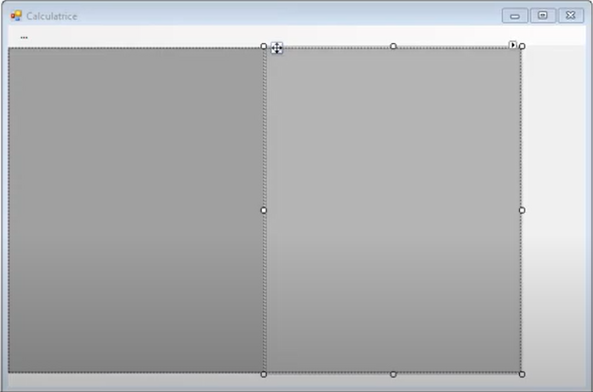
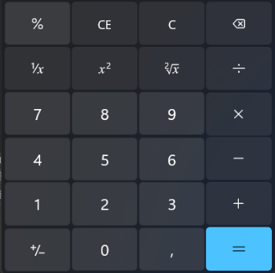
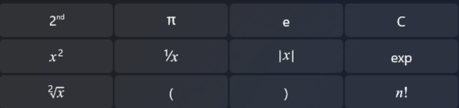
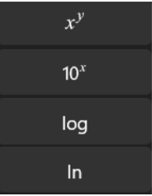

# Workshop-.NET-WPF
WorkShop Epitech decouverte du C# et des application WPF

## Pour commencer

### Pré-requis

Passer sur une distribution de Windows ou MAC.

### Installation et initialisation

Installation Visual Studio:
  - Rendez-vous sur [``https://visualstudio.microsoft.com/fr/downloads/``](https://visualstudio.microsoft.com/fr/downloads/)
  - Télécharger la version Communauté de Visual Studio.

Initialisation du projet:
  - Créer une application WPF avec .NET : [``https://learn.microsoft.com/fr-fr/dotnet/desktop/wpf/get-started/create-app-visual-studio?view=netdesktop-6.0``](https://learn.microsoft.com/fr-fr/dotnet/desktop/wpf/get-started/create-app-visual-studio?view=netdesktop-6.0)

## C'est parti !

### Partie 1 - Création de deux interfaces

- Cotées WPF dans le .xaml tous le code est a impletemnter pour la partit graphique 
- le cotées fonctionelle des interaction avec l'interface elle sera en C#

-TIPS:
  - lorsque vous double cliquez sur un element dans le previsualisateur graphique il vous genere la fonction nécessaire pour celle la
  - les interaction sont donc plus fluide

 - Créer un MenuItem (menu contextuelle) avec un onglet principale « … » contenant deux sous menus :
    - Standard
    - Scientifique

- Créer deux panels avec un arrière plan gris, et un arrière plan noir.

- Lorsque le sous-menu "Standard" est seléctionné, faire en sorte d'ouvrir le panel gris
- Lorsque le sous-menu "Scientifique" est seléctionné, faire en sorte d'ouvrir les deux panels gris et noir.
- Créer une TextBox qui servira par la suite, d’afficher le résultat.

### Partie 2 - Calculatrice Standard

- Créer les 24 boutons suivant avec leur texte inclus
- Responsive faire en sorte d'obtenir un visuelle correct

- Une fois que les boutons sont crées, faire en sorte que chaque bouton de chiffre écrive sa valeur dans la TextBox.

- Espacer les boutons avec un margin 1 entre chaque boutton et faire en sorte que le rendu soit responsive.
- Faire les actions des boutons opérants afin de pouvoir additionner, soustraire... les valeurs contenues dans les TextBox. Et bloquer les actions impossibles (ex: division par 0).
- Implémenter les boutons des autres fonctionnalités (CE, C, suppr...)
- Afficher le résultat lors de l’interaction avec le bouton ‘=’

### Partie 3 - Calculatrice Scientifique

- Comme pour la partie Standard, créer et implémenter les boutons suivants.

## Auteurs
* **Pierre Plassio** _alias_ [@pierre-plassio](https://www.linkedin.com/in/pierre-plassio/)
* **Harry Laudy** _alias_ [@harry-laudy](https://www.linkedin.com/in/harry-laudy/)

